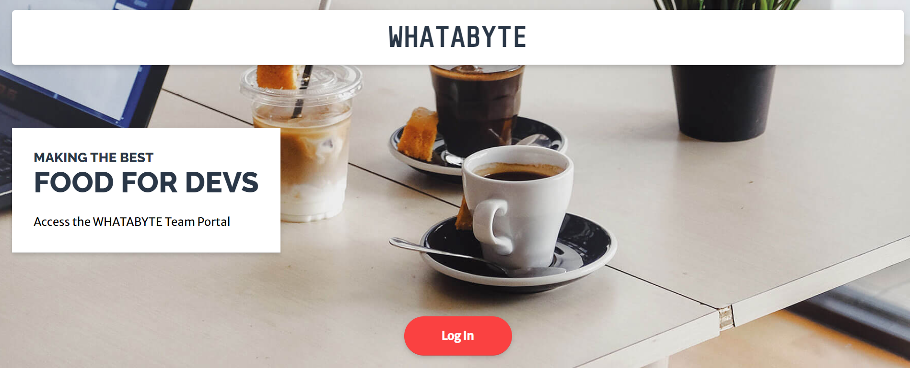

# Whatabyte - portal

## I have followed below tutorial to dive into an auth0 authentication process with Express.js with server side rendering, using pug.

[Tutorial](https://auth0.com/blog/create-a-simple-and-secure-node-express-app/)

# Printscreen of the website

